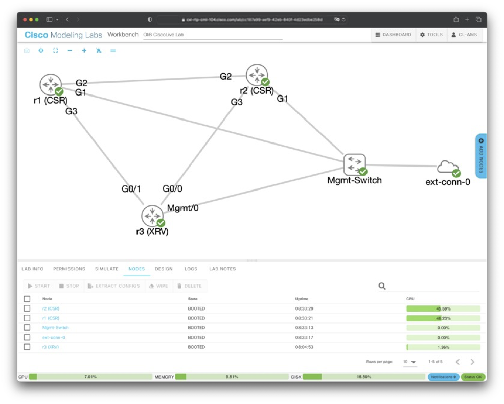

## Lab Information

This lab was created using [Cisco Modelling Labs (CML)](https://www.cisco.com/c/en/us/products/cloud-systems-management/modeling-labs/index.html) and consists of two IOS-XE and one IOS-XR virtual routers conncted in a triangle:

The management switch is used to provide SSH connectivity for the test scripts to access the devices.

Configs used in the lab are included in this directory.
